# LPOO_T7G4 - FLEE THE ROOM

## Descrição do projeto e autores

O nosso projeto consiste num jogo com interface no terminal (biblioteca lanterna) em que temos que chegar com o player controlado pelo teclado até um objetivo. Até lá temos obstáculos que temos de avançar como fechaduras que precisam de chaves e puzzles com interface própria.

Este trabalho foi realizado por:
* Davide Castro (up201806512@fe.up.pt)
* Ricardo Fontão (up201806317@fe.up.pt)

## Features implementadas

### Selecionador de níveis
Selecionador de níveis operado pelas teclas das setas. Guarda o progresso, ou seja, se o nível já foi completado antes de forma persistente entre execuções. Isto pode ser visto de acordo com o símbolo &#128504; para completo e o símbolo &#10008; para ainda não completo. É também possível efetuar um *reset* do mesmo com a tecla Esc.

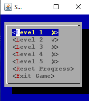

### Níveis / Salas
Níveis compostos por salas delimitadas por paredes e onde o personagem se pode mover-se com as setas e interagir com objetos que lá se encontrem(tecla E).
Cada nível tem um objetivo, representado pelo símbolo na imagem abaixo, em azul.

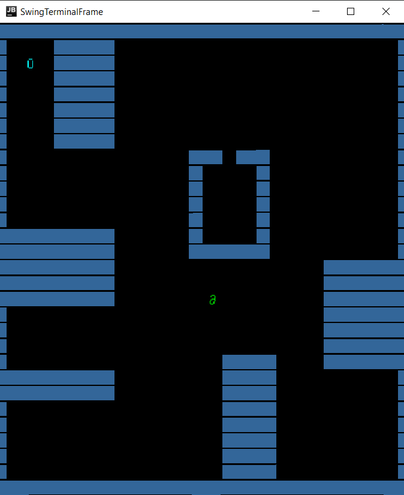

### Portas e chaves
É possível o jogador deparar-se com uma porta, que só consegue atravessar após adquirir uma chave, representada na mesma cor que a porta.
No canto inferior do ecrã existem contadores para as chaves de cada cor.

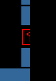

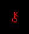

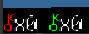

### *Sliders*
Representados no nível como setas bidirecionais horizontais ou verticais, o jogador pode empurrar *sliders* nas direções que apontam,
se estiver posicionado da maneira correta para tal. Por exemplo, para empurrar um *slider* horizontal para a direita, o 
jogador precisa de estar na posição imediatamente à esquerda do *slider* e andar para a direita.
Os *sliders* colidem entre si e podem empurrar-se até atingirem uma parede, porta fechada ou outros objetos do nível.

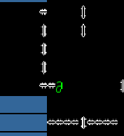

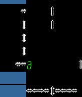

### Puzzles
Em cada nível, o jogador pode interagir com certos butões ou obstáculos que abrem uma janela separada, com um puzzle a resolver.
Para completar o nível, os puzzles têm também de ser corretamente completados. Existe uma variedade de puzzles possíveis, descritos abaixo.

#### Sequência de cores
Neste puzzle, uma sequência intermitente de cores, gerada aleatoriamente, será inicialmente apresentada ao jogador. Depois de terminada a apresentação da sequência, o jogador deverá recriar a sequência que lhe foi mostrada pela ordem correta para completar o puzzle.

Menu para adivinhar a combinação:

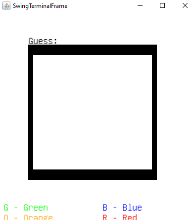

Puzzle acabado: 

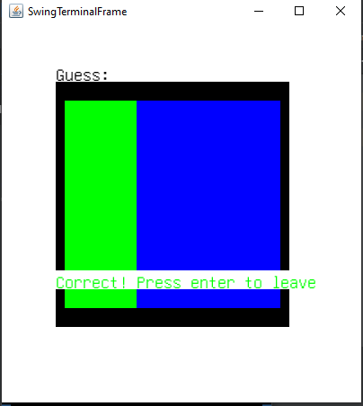

#### Puzzle de peças
Neste puzzle, começamos com 6 peças retiradas de uma imagem inicial e baralhadas e posicionadas aleatoriamente no ecrã. 
O objetivo é mover as peças de forma a posicioná-las no sítio correto dentro da moldura fornecida. 
O jogador pode alternar pelas peças uma de cada vez carregando na tecla E. Isto faz com que esta fique destacada das restantes. Torna-se então possível movê-la nas 4 direções(Setas).
O puzzle acaba quando a imagem for igual à imagem inicial.

Peças em posições aleatórias:

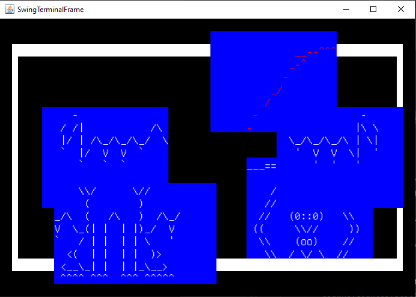

Puzzle completo:

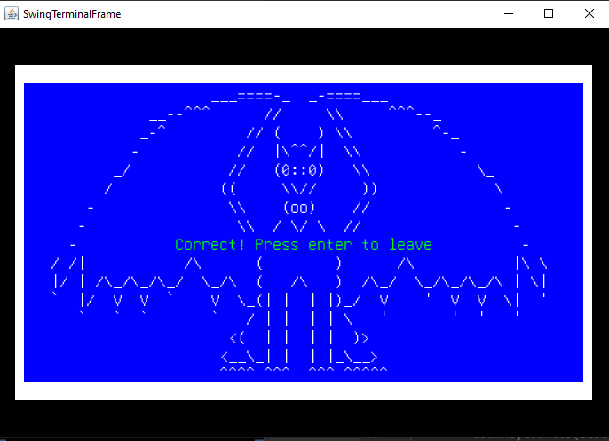

#### Sequência de números
É apresentada uma sequência de 6 dígitos ao jogador e uma grelha de números,
na qual está também a sequência alvo. O objetivo é o jogador conseguir localizar a sequência entre os
outros dígitos enquanto que estes são randomizados e a posição do alvo alterada a cada *update*. O intervalo de tempo entre
*updates* depende da dificuldade do nível onde o puzzle se encontra, sendo menor em dificuldades maiores. O utilizador pode usar
as setas do teclado para mudar a seleção e a tecla 'E' para submeter essa seleção. O puzzle é completado se a sequência
selecionada for a alvo.

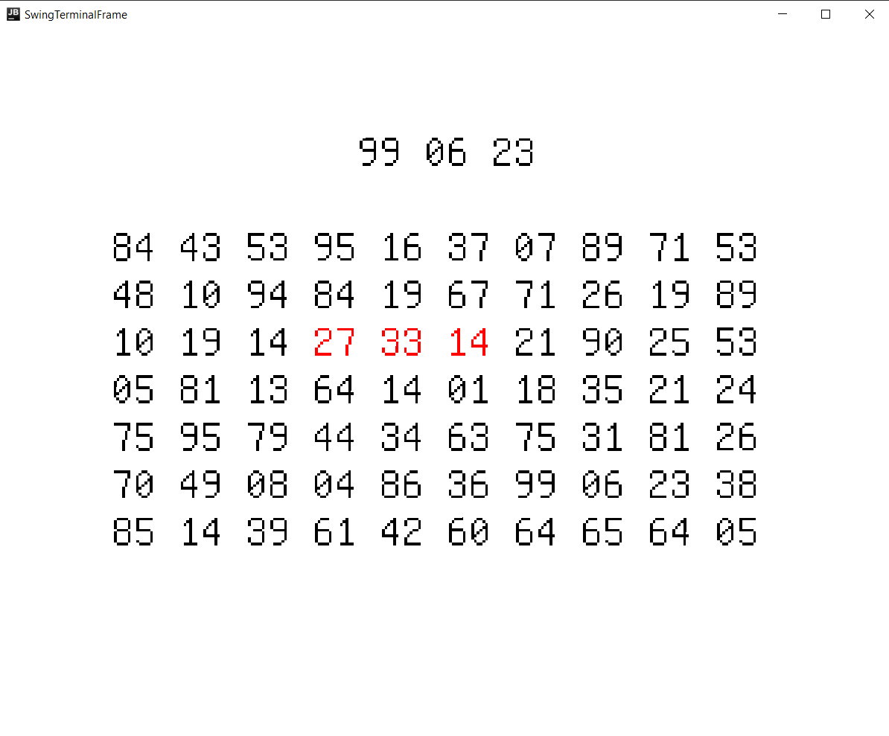

Puzzle completo:

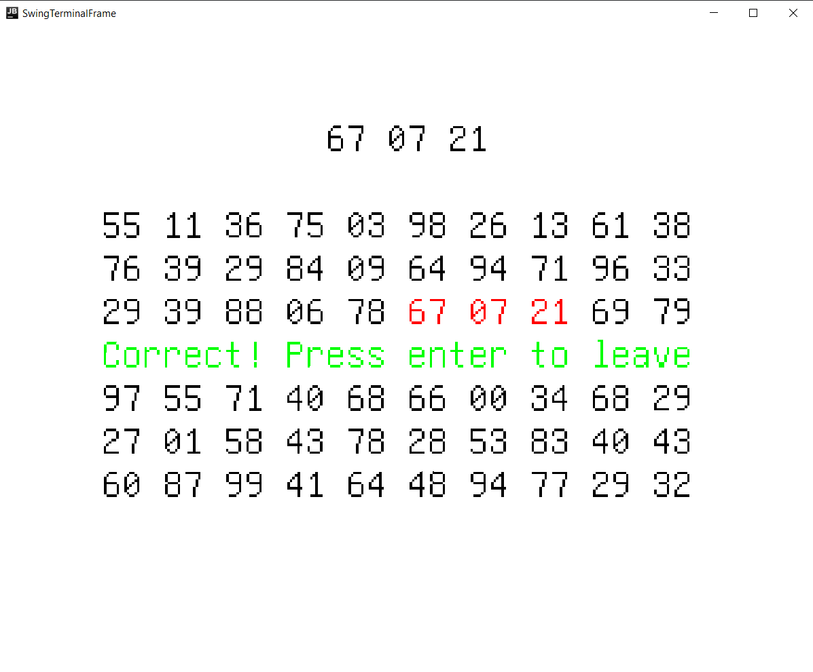

### Música
Ao entrar nos níveis, é reproduzida música de fundo para o jogador. Existem vários *tracks*,
dedicados aos diferentes tipos de puzzle e são reproduzidos enquanto o jogador os tenta completar, voltando depois à música do nível.

## Gif do Projeto

## Design

### Command design pattern

#### Problema

Neste jogo é necessário o tratamento de inputs do utilizador recebidos pela view mudando o nível de forma adequado. Desta forma tentámos retirar a responsabilidade do input handler e passá-la para os controladores do jogo.

#### Design Pattern

Desta forma escolhemos o design pattern **Command**. Este design patterns permite-nos que o input handler não tenha de interagir diretamente com o nível respeitando assim a arquitetura MVC e respeitando o **Single Responsability Principle** visto que fica separado quem invoca as mudanças ao nível de quem as executa. Este pattern adequa-se às nossas necessidades visto que nos permite adicionar ações ao jogo adicionando o mínimo de código possível.

#### Implementação

Na nossa implementação decidimos criar um interface **Command** que força a implementação de uma só função *execute*. A partir daí fizemos todos as classes de command a implementar este interface. A nossa implementação divide-se em duas partes: 

1. Commands do nível
2. Commands dos puzzles

Os commands do nível estão da seguinte maneira:

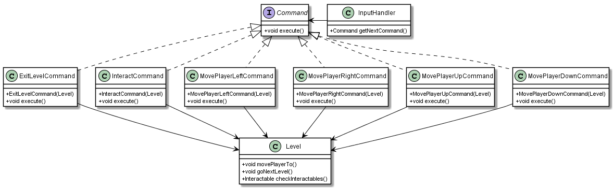

Estas classes podem ser encontradas em: src\main\java\com\fleeTheRoom\controllers\commands

#### Consequências

* Torna-se muito fácil adicionar comportamentos ao input handler visto que para isso basta adicionar um comando novo
* Separa o objeto que invoca a operação(Input handler) de quem a execute(Command)
* Ajuda na implementação da arquitetura MVC

### Observers design pattern

#### Problema
No jogo precisamos de saber quando queremos desenhar o nível, visto que isto só é feito quando o nível se altera. Ou seja, quando existe algum input do utilizador.

#### Observer design pattern
Desta forma escolhemos o design pattern **Observer**. Este design pattern permite ao nível notificar o Game de que foi alterado e que é necessário redesenhar o ecrã.

#### Implementação

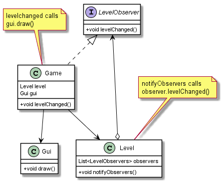

#### Consequências

* Reduzimos ao mínimo o número de vezes que desenhamos no ecrã, visto que o fazemos quando é necessário (mudanças no nível)

### Factory design pattern

#### Problema

No nosso projeto deparámo-nos com a necessidade de criar vários TerminalScreen de para os GUI de cada puzzle que temos.

#### Design Pattern

Desta forma escolhemos o design pattern **Factory**. Este design pattern permite-nos ter uma classe distinta que é apenas focada em gerar os TerminalScreen necessários. Desta forma poupamos imenso código repetido espalhado por cada view de cada puzzle.

#### Implementação

Na nossa implementação decidimos criar um classe **TerminalScreenFactory** que apenas contém uma função estática **generateScreen** que baseada nos seus parâmetros retorna um TerminalScreen.

Link para o código: [Factory](https://github.com/FEUP-LPOO/lpoo-2020-g74/blob/master/src/main/java/com/fleeTheRoom/view/TerminalScreenFactory.java)

#### Consequências

* Torna-se muito fácil adicionar outros tipos de TerminalScreens a ser gerados (por exemplo, alguma predefinições).
* Torna o código mais legível visto que basta uma chamada a uma função para gerar um Screen.

### Arquitetura MVC

Neste projeto usamos a arquitetura MVC(Model-View-Controller). Desta forma implementamos o nosso jogo dividido em três partes:

1. Models - Classes que apenas contém informação sobre os elementos do jogo (Entity e as suas subclasses)
2. View - Classes que mostram no ecrã os dados relativos ao jogo e recebem inputs do utilizador passando-os aos Controllers para serem interpretados(Gui, PuzzleGUi, InputHandler, etc...)
3. Controllers - Classes que manipulam os dados dos Models de acordo com os inputs recebidos da View e informa a view quando esta deve desenhar os Models.(Commands, Creators)

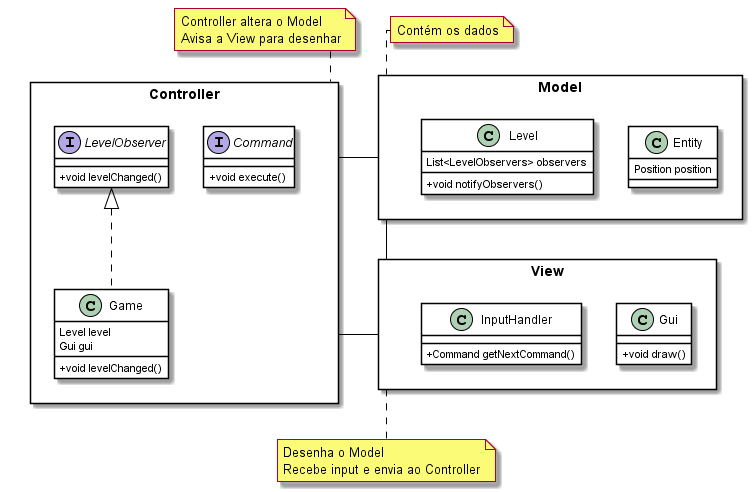

## Code Smells

### LevelCreator (Resolvido)

Esta função tem como objetivo criar objetos da class Level a partir de ficheiros txt. No entanto apenas contém um método bastante extenso que faz todo o trabalho sozinho. Desta forma, este método parece ser um **Bloater** visto ser um **Long Method**.

Uma sugestão de refactoring seria separar a fase em que abrimos o ficheiro da parte em que o processamos e desta forma separar as responsabilidades do método(**Extract method**).

**Nota:** Este code smell foi resolvida com simplificação de um switch case que era longo e desnecessário e a criação de um método ajudante que simplica a legibilidade do código em alguns if statements.

Código antes - [Intermediate LevelCreator](https://github.com/FEUP-LPOO/lpoo-2020-g74/blob/intermediate/src/main/java/com/fleeTheRoom/controllers/creators/LevelCreator.java) 

Código depois - [Final LevelCreator](https://github.com/FEUP-LPOO/lpoo-2020-g74/blob/master/src/main/java/com/fleeTheRoom/controllers/creators/LevelCreator.java)

Apesar das alterações este função com um if statement demasiado grande. No entanto, não encontrámos maneira de melhorá-lo.

### Derivadas de entity

Nas classes que temos como models do nível temos várias class que derivam da classe Entity. No entanto algumas não possuem atributos extra nem implementam métodos extra(**Lazy Class**). Esta escolha foi feita de forma a pensar na expansão do programa. 

Para resolver este code smell bastaria usar o refactor **Collapse Hierarchy**, ou seja, remover as subclasses e usar apenas a superclasse.

### Dead code em TilesPuzzleView (Resolvido)

Nesta classe temos um método chamado drawBackground que náo é usado (**Dead code**).

Isto pode ser resolvido eliminando o método.

**Nota:** A função que não era utilizada passou a ser.

### A classe Level

A nossa classe Level tem um comprimento provavelmente maior do que o necessário(**Long Class**).

Para resolver este code smell podíamos usar o refactor **Extract class**, visto que algumas partes desta classe podem ser transferidas para uma Controller class de acordo com a arquitetura MVC.

### Código duplicado 

Nas classes "Puzzle view" encontramos algum código duplicado nos métodos drawOptions e drawGuess relativo a TextGraphics por exemplo(**Duplicate Code**).

Este code smell pode ser resolvido com o refactor **Extract method** reduzindo o código duplicado e aumentando a usabilidade do mesmo.

### Operadores *If* complexos

Por exemplo, na classe FindSeqPuzzle, no método randomizeSeqPos, são usadas várias sequências de if/else if
para determinar a próxima posição randomizada da sequência de números.

O code smell poderia ser resolvido com o método **Replace Nested Conditional with Guard Clauses**.
## Testing

Testes:

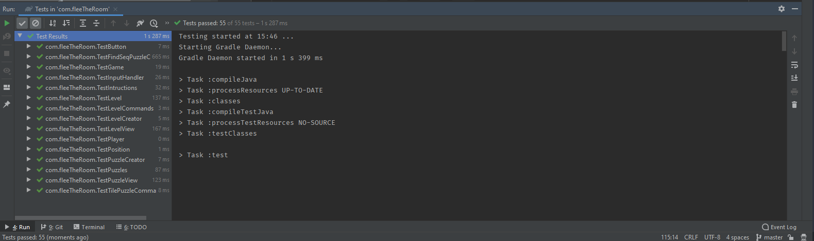

Coverage:

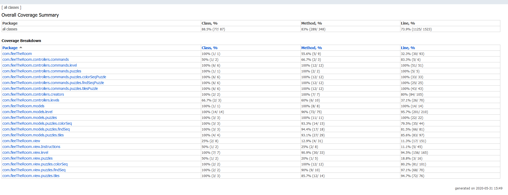

Mutation report: [Mutation Report](tests/pitest-final)

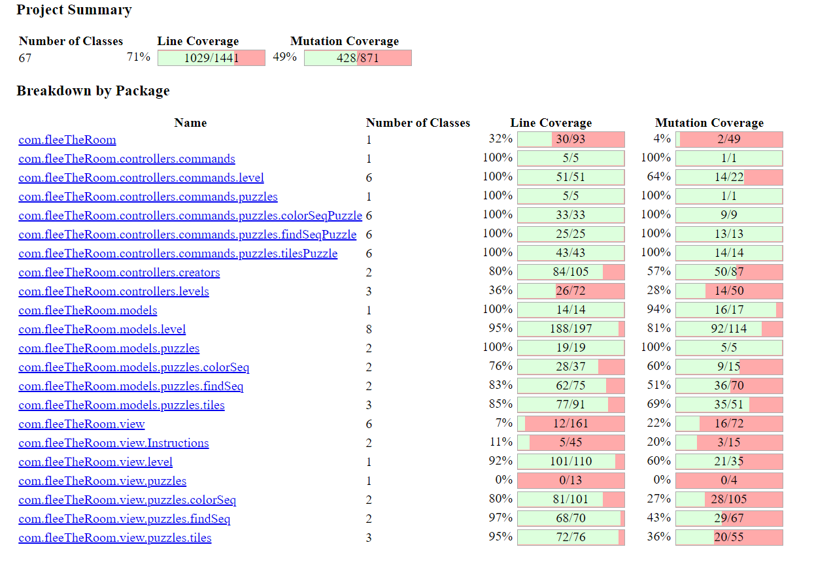

## Self-evaluation

Tempo de trabalho: 70-80h(Estimativa)

Divisão trabalho: 

Ricardo Fontão (50%):

1. Puzzle da sequência de cores
2. InfoGUI(informação das chaves possuídas pelo player)
3. Chaves/portas coloridas
4. LevelSelectorGUI
5. Painel de instruções
6. Terminal Factory

Davide Castro (50%):

1. Puzzle da imagem
2. Sliders
3. Chaves/portas
4. Armazenamento de progresso dos níveis
5. Puzzle de sequência de números
6. Botões com porta
7. Música

Conjunto:

1. Parser de níveis e de dados dos gráficos
2. Implementação do código hero das aulas e adaptação
3. Desenho de níveis
4. Testes

